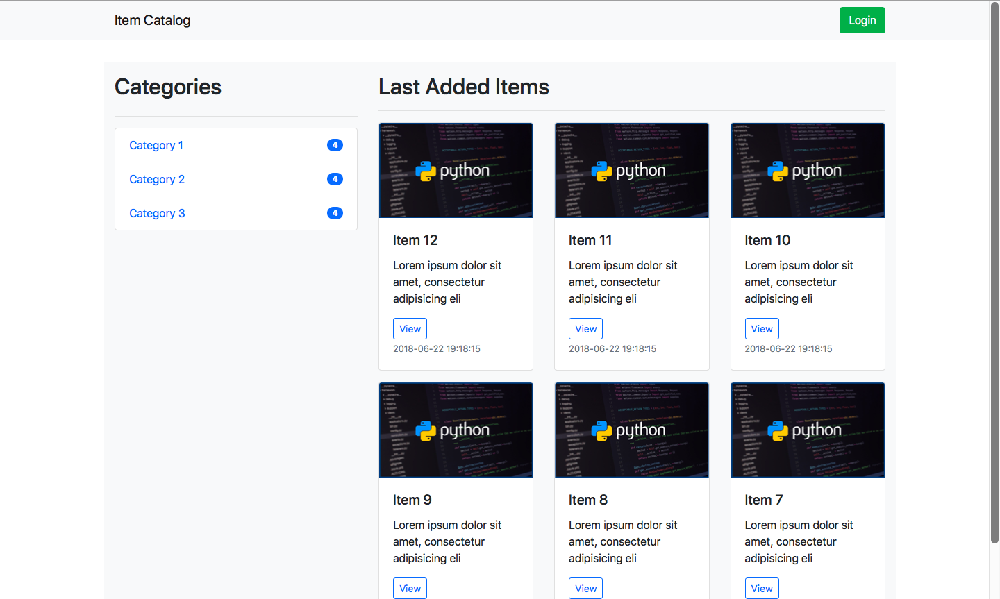
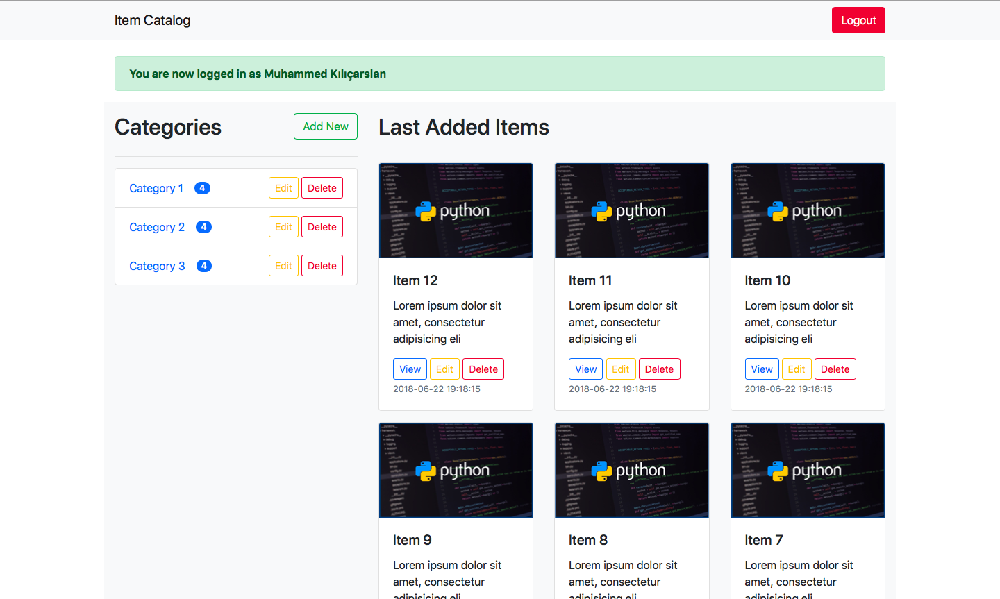
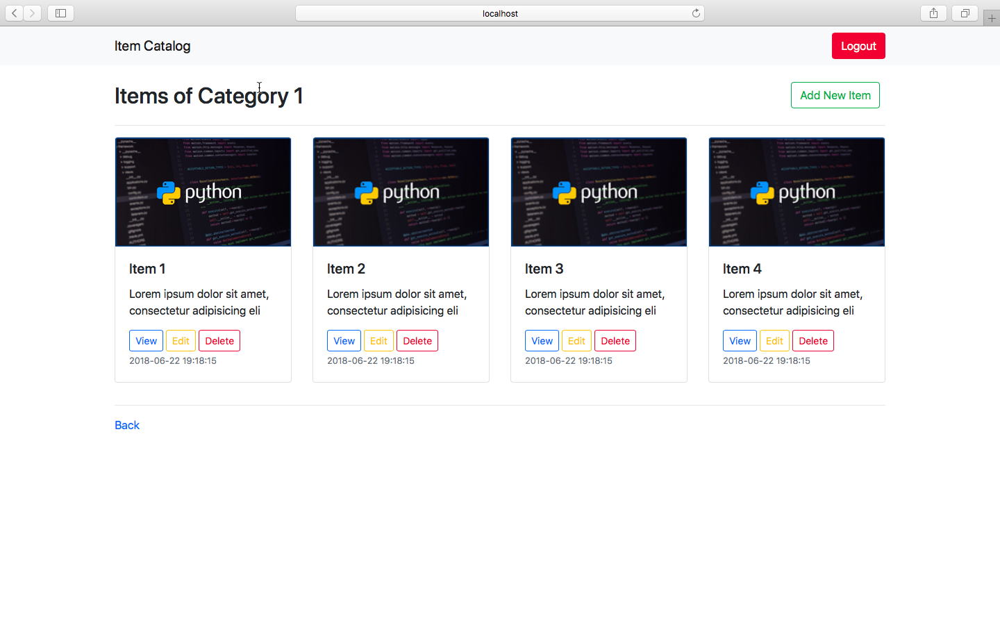
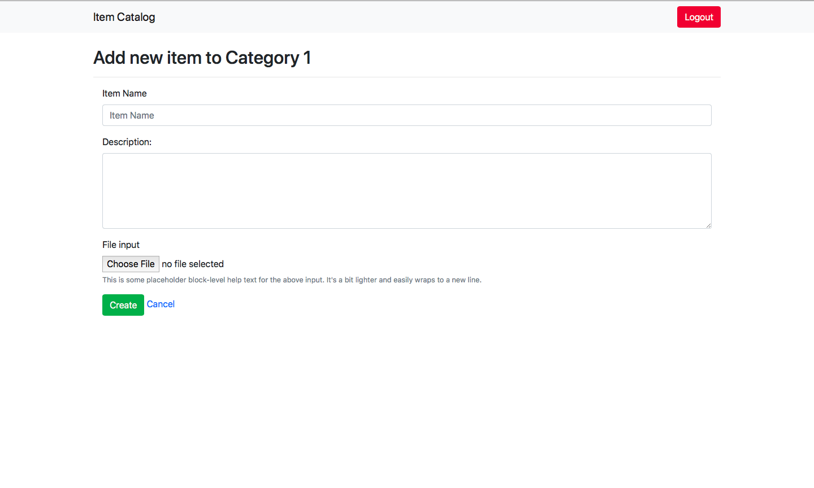
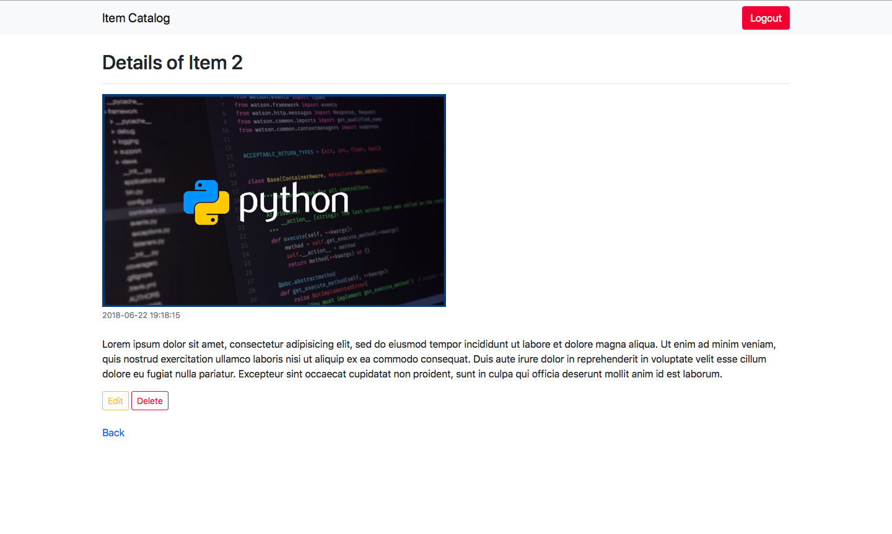

# Item Catalog

This project is for Udacity's [Full Stack Web Developer Nanodegree](https://www.udacity.com/course/full-stack-web-developer-nanodegree--nd004).

## About this project

### Project overview from Udacity

You will develop an application that provides a list of items within a variety of categories as well as provide a user registration and authentication system. Registered users will have the ability to post, edit and delete their own items.

### Tech Stack
* Python3
* Flask
* Bootstrap
* Oauth2
* Vagrant
* VirtualBox

### Sample screenshots from project:
- Homepage:

- Homepage After Login:

- Items of a Category:

- Add New Item:

- Show Item Details:

## How to run the project

1. Install [Vagrant](https://www.vagrantup.com/downloads.html) and [VirtualBox](https://www.virtualbox.org/wiki/Download_Old_Builds_5_1)
2. [Download](https://s3.amazonaws.com/video.udacity-data.com/topher/2018/April/5acfbfa3_fsnd-virtual-machine/fsnd-virtual-machine.zip) the VM configuration or clone [this repository](https://github.com/udacity/fullstack-nanodegree-vm)
3. `cd` inside that directory from your terminal. Then change directory to vagrant with `cd vagrant`
4. Start the Ubuntu Linux installation with `vagrant up`
5. Run `vagrant ssh` to log in to installed Linux VM
6. Run `cd /vagrant`
7. Clone this project with `git clone https://github.com/mka281/item-catalog.git`
8. Run `cd item-catalog`
9. If you want to have sample items run `python fakeItems.py` or `python3 fakeItems.py`
10. Run the app with `python application.py` or `python3 application.py`
11. Visit `localhost:5000` on your browser to view the homepage.
12. You'll be able to add-edit-delete items and categories after logging in with your Google account

### JSON Endpoints
This project provides three different kinds of JSON endpoints.
* `localhost:5000/api/v1/categories/JSON`
This route will display all categories and related information about them.
* `localhost:5000/api/v1/categories/<int:category_id>/items/JSON`
Write the id of a specific category instead of `<int:category>` and this route will show all items of that category.
* `localhost:5000/api/v1/categories/<int:category_id>/items/<int:item_id>/JSON`
Write the id of a category and the id of an item that belongs to specified category. This will return information about that item with JSON format.
